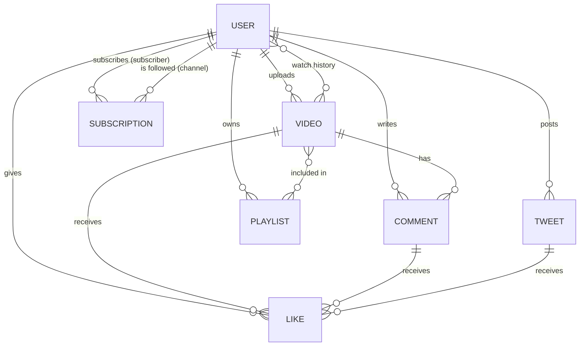

<div align="center">

# 🎬 VideoMate API

**A production-style REST API for a video-sharing platform with social features — built with Node.js, Express 5 and MongoDB.**

[](https://nodejs.org/)
[](https://expressjs.com/)
[](https://www.mongodb.com/)
[](#-api-documentation)
[](#-license)

[API Docs](#-api-documentation) · [Getting Started](#-getting-started) · [Endpoints](#-api-endpoints) · [Contributing](#-contributing)

</div>

---

## 📖 Table of Contents

- [Overview](#-overview)
- [Features](#-features)
- [Tech Stack](#-tech-stack)
- [Project Structure](#-project-structure)
- [Getting Started](#-getting-started)
- [Environment Variables](#-environment-variables)
- [API Documentation](#-api-documentation)
- [API Endpoints](#-api-endpoints)
- [Authentication](#-authentication)
- [Response & Error Format](#-response--error-format)
- [Data Model](#-data-model)
- [Security](#-security)
- [Troubleshooting](#-troubleshooting)
- [Roadmap](#-roadmap)
- [Contributing](#-contributing)
- [Author](#-author)
- [License](#-license)

---

## 🔍 Overview

VideoMate is a backend service that combines the core of a video platform (upload, publish, watch history) with social features (comments, likes, playlists, subscriptions and short text posts called *tweets*).

It focuses on clean architecture and safe defaults: every request is validated with **Zod**, protected routes use **JWT authentication**, uploads are streamed to **Cloudinary**, and the whole API is documented with **Swagger (OpenAPI)**.

## ✨ Features

- **Authentication & Authorization** — register, login, logout, JWT access + refresh tokens, password change
- **User profiles** — avatar and cover image upload, channel profile pages, watch history
- **Videos** — upload video + thumbnail, publish/unpublish, edit, delete, list with pagination
- **Comments** — add, edit, delete and paginate comments on videos
- **Likes** — toggle likes on videos, comments and tweets; list liked videos
- **Playlists** — create, update, delete, add and remove videos
- **Subscriptions** — subscribe/unsubscribe to channels, list subscribers and subscribed channels
- **Tweets** — short community posts per user
- **Request validation** — Zod schemas for body, params, query and uploaded files
- **Rate limiting** — global limiter plus stricter limiters for auth and upload routes
- **Centralised error handling** — consistent JSON errors and a 404 fallback
- **Interactive API docs** — Swagger UI served by the app itself
- **Health check** endpoint for uptime monitoring

## 🧰 Tech Stack

| Layer | Technology |
| --- | --- |
| Runtime | Node.js (ES Modules) |
| Framework | Express 5 |
| Database | MongoDB with Mongoose 9 |
| Pagination | `mongoose-aggregate-paginate-v2` |
| Auth | JSON Web Tokens (`jsonwebtoken`), `bcrypt` |
| Validation | Zod |
| File uploads | Multer (temp storage) → Cloudinary |
| Security / Ops | `cors`, `cookie-parser`, `express-rate-limit` |
| API docs | `swagger-jsdoc`, `swagger-ui-express` |
| Tooling | Nodemon, Prettier |

## 📁 Project Structure

```text
videoMate
├── public/
│   └── temp/                  # Temporary storage for uploads before Cloudinary
├── src/
│   ├── config/
│   │   ├── cors.config.js     # CORS options
│   │   └── swagger.config.js  # OpenAPI / Swagger setup
│   ├── controllers/           # Request handlers (business logic)
│   ├── db/
│   │   └── index.js           # MongoDB connection
│   ├── middlewares/
│   │   ├── auth.middleware.js         # JWT verification
│   │   ├── optionalAuth.middleware.js # Auth that doesn't block guests
│   │   ├── errorHandler.middleware.js # Global error handler
│   │   ├── multer.middleware.js       # File upload handling
│   │   ├── rateLimit.middleware.js    # General / auth / upload limiters
│   │   └── validate.middleware.js     # Zod validation wrapper
│   ├── models/                # Mongoose schemas
│   ├── routes/                # Route definitions + Swagger annotations
│   ├── utils/
│   │   ├── ApiError.js
│   │   ├── ApiResponse.js
│   │   ├── asyncHandler.js
│   │   └── cloudinaryUpload.js
│   ├── validators/            # Zod schemas
│   ├── app.js                 # Express app, middleware and route mounting
│   ├── constants.js
│   └── index.js               # Entry point (DB connect + server start)
├── .env                       # Local environment variables (never commit)
├── .env.example               # Template for environment variables
└── package.json
```

## 🚀 Getting Started

### Prerequisites

- [Node.js](https://nodejs.org/) **v18 or newer** (v20 LTS recommended)
- A [MongoDB](https://www.mongodb.com/) database — local or [MongoDB Atlas](https://www.mongodb.com/atlas)
- A free [Cloudinary](https://cloudinary.com/) account for media storage

### Installation

```bash
# 1. Clone the repository
git clone https://github.com/awais-hash/videoMate.git
cd videoMate

# 2. Install dependencies
npm install

# 3. Create your environment file and fill in the values
cp .env.example .env

# 4. Start the development server (with auto-reload)
npm run dev
```

If everything is configured correctly you should see the **"DB connected successfully"** and **"server is running"** messages in your terminal.

Quick check:

```bash
curl http://localhost:3000/api/v1/health
```

### Available scripts

| Command | Description |
| --- | --- |
| `npm run dev` | Starts the server with Nodemon and loads `.env` |

For production, run the entry file directly with Node: `node src/index.js`.

## 🔐 Environment Variables

Create a `.env` file in the project root (use `.env.example` as a template).

| Variable | Description | Example |
| --- | --- | --- |
| `PORT` | Port the server listens on | `3000` |
| `NODE_ENV` | Runtime environment | `development` |
| `DATABASE_URI` | MongoDB connection string | `mongodb+srv://<user>:<password>@<cluster>/...` |
| `CORS_ORIGIN` | Allowed origin(s) for CORS | `http://localhost:5173` |
| `ACCESS_TOKEN_SECRET` | Secret used to sign access tokens | *long random string* |
| `ACCESS_TOKEN_EXPIRY` | Access token lifetime | `1d` |
| `REFRESH_TOKEN_SECRET` | Secret used to sign refresh tokens | *long random string* |
| `REFRESH_TOKEN_EXPIRY` | Refresh token lifetime | `10d` |
| `CLOUDINARY_CLOUD_NAME` | Cloudinary cloud name | `my-cloud` |
| `CLOUDINARY_API_KEY` | Cloudinary API key | — |
| `CLOUDINARY_API_SECRET` | Cloudinary API secret | — |

> ⚠️ **Never commit your `.env` file.** Generate strong secrets with:
> `node -e "console.log(require('crypto').randomBytes(64).toString('hex'))"`

## 📚 API Documentation

Interactive documentation is served by the app through Swagger UI:

**👉 http://localhost:3000/api/v1/docs**

You can explore every endpoint, see request/response schemas and try requests directly from the browser. For protected routes, click **Authorize** and paste your access token.

<!-- Add a screenshot of your Swagger UI here:

-->

All endpoints are prefixed with **`/api/v1`**.

## 🛣️ API Endpoints

Legend: 🔓 public · 🔒 authentication required · 🔓/🔒 optional authentication

### Health

| Method | Endpoint | Auth | Description |
| --- | --- | :---: | --- |
| GET | `/health` | 🔓 | Check that the server is running |

### Users — `/users`

| Method | Endpoint | Auth | Description |
| --- | --- | :---: | --- |
| POST | `/users/register` | 🔓 | Register a user (multipart: `avatar`, `coverImage`) |
| POST | `/users/login` | 🔓 | Log in and receive tokens |
| POST | `/users/logout` | 🔒 | Log out the current user |
| POST | `/users/refresh-access-token` | 🔓 | Get a new access token via refresh token |
| POST | `/users/update-password` | 🔒 | Change password |
| POST | `/users/update-details` | 🔒 | Update account details |
| GET | `/users/current-user` | 🔒 | Get the logged-in user |
| PATCH | `/users/update-avatar` | 🔒 | Replace avatar image |
| PATCH | `/users/update-cover-image` | 🔒 | Replace cover image |
| GET | `/users/c/:userName` | 🔒 | Get a channel profile |
| GET | `/users/history` | 🔒 | Get watch history |
| PATCH | `/users/history-clear` | 🔒 | Clear watch history |

### Videos — `/videos`

| Method | Endpoint | Auth | Description |
| --- | --- | :---: | --- |
| POST | `/videos/publish` | 🔒 | Upload a video and thumbnail |
| GET | `/videos` | 🔓 | List videos (pagination, search, sorting) |
| GET | `/videos/:videoId` | 🔓/🔒 | Get a video by id |
| PATCH | `/videos/:videoId` | 🔒 | Update title, description, thumbnail |
| DELETE | `/videos/:videoId` | 🔒 | Delete a video |
| PATCH | `/videos/:videoId/publish` | 🔒 | Toggle publish status |

### Comments — `/comments`

| Method | Endpoint | Auth | Description |
| --- | --- | :---: | --- |
| GET | `/comments/:videoId` | 🔓 | List comments of a video |
| POST | `/comments/:videoId` | 🔒 | Add a comment |
| PATCH | `/comments/c/:commentId` | 🔒 | Update a comment |
| DELETE | `/comments/c/:commentId` | 🔒 | Delete a comment |

### Likes — `/likes`

| Method | Endpoint | Auth | Description |
| --- | --- | :---: | --- |
| GET | `/likes/videos/liked` | 🔒 | Get videos liked by the user |
| POST | `/likes/toggle/video/:videoId` | 🔒 | Like / unlike a video |
| POST | `/likes/toggle/comment/:commentId` | 🔒 | Like / unlike a comment |
| POST | `/likes/toggle/tweet/:tweetId` | 🔒 | Like / unlike a tweet |

### Playlists — `/playlists`

| Method | Endpoint | Auth | Description |
| --- | --- | :---: | --- |
| POST | `/playlists` | 🔒 | Create a playlist |
| GET | `/playlists/user/:userId` | 🔓 | List a user's playlists |
| GET | `/playlists/:playlistId` | 🔓 | Get a playlist by id |
| PATCH | `/playlists/:playlistId` | 🔒 | Update a playlist |
| DELETE | `/playlists/:playlistId` | 🔒 | Delete a playlist |
| PATCH | `/playlists/add/:videoId/:playlistId` | 🔒 | Add a video to a playlist |
| PATCH | `/playlists/remove/:videoId/:playlistId` | 🔒 | Remove a video from a playlist |

### Subscriptions — `/subscriptions`

| Method | Endpoint | Auth | Description |
| --- | --- | :---: | --- |
| POST | `/subscriptions/toggle/:channelId` | 🔒 | Subscribe / unsubscribe |
| GET | `/subscriptions/c/:channelId` | 🔒 | List subscribers of a channel |
| GET | `/subscriptions/u/:subscriberId` | 🔒 | List channels a user subscribed to |

### Tweets — `/tweets`

| Method | Endpoint | Auth | Description |
| --- | --- | :---: | --- |
| POST | `/tweets` | 🔒 | Create a tweet |
| GET | `/tweets/user/:userId` | 🔓 | List a user's tweets |
| PATCH | `/tweets/:tweetId` | 🔒 | Update a tweet |
| DELETE | `/tweets/:tweetId` | 🔒 | Delete a tweet |

## 🔑 Authentication

VideoMate uses a **JWT access token + refresh token** flow.

1. **Log in** with `POST /api/v1/users/login`. The API issues an access token (short-lived) and a refresh token (long-lived).
2. Send the access token with every protected request, either as an HTTP cookie or in the header:

   ```http
   Authorization: Bearer <ACCESS_TOKEN>
   ```

3. When the access token expires, call `POST /api/v1/users/refresh-access-token` to get a new one without logging in again.
4. **Log out** with `POST /api/v1/users/logout` to invalidate the session.

Passwords are hashed with `bcrypt` and are never stored or returned in plain text.

## 📦 Response & Error Format

Every response follows a consistent JSON structure.

**Success**

```json
{
  "statusCode": 200,
  "data": {},
  "message": "Success",
  "success": true
}
```

**Error** (including unknown routes)

```json
{
  "success": false,
  "message": "Route not found",
  "statusCode": 404
}
```

Common status codes: `200` OK · `201` Created · `400` Validation error · `401` Unauthorized · `403` Forbidden · `404` Not found · `409` Conflict · `429` Too many requests · `500` Server error.

## 🗂️ Data Model

The application is built around seven collections. The diagram shows how they relate to each other.



## 🛡️ Security

- **Input validation** on body, params, query and files using Zod
- **Rate limiting** — a global limiter, plus stricter limits on authentication and upload routes
- **Password hashing** with bcrypt
- **JWT** access/refresh tokens with configurable expiry
- **Request size limits** — JSON and form bodies are capped at 20 KB
- **Configurable CORS** through `CORS_ORIGIN`
- **Secrets stay out of the repo** — `.env` is git-ignored

> 🔒 **Production tip:** never leave `CORS_ORIGIN=*` in production. Set it to your real frontend origin(s).

## 🩺 Troubleshooting

| Problem | Solution |
| --- | --- |
| `YAMLSemanticError` when starting the server | A Swagger comment in a route file is mis-indented. YAML needs consistent **spaces** (no tabs); each `description` must sit under its own status code. |
| `querySrv ECONNREFUSED` / MongoDB Atlas won't connect | Some networks block SRV DNS lookups. The entry file already sets public DNS servers; also check your Atlas IP allow-list and credentials. |
| `401 Unauthorized` on protected routes | Make sure the access token is sent (cookie or `Authorization: Bearer`) and hasn't expired. |
| `429 Too Many Requests` | You hit a rate limit — wait a moment and retry. |
| Upload fails | Check the Cloudinary keys in `.env` and that `public/temp` exists. |

## 🗺️ Roadmap

- [ ] Automated tests (Jest + Supertest)
- [ ] Dockerfile and `docker-compose` setup
- [ ] CI pipeline with GitHub Actions
- [ ] Redis caching for hot endpoints
- [ ] Notifications and video view counters
- [ ] Deployment guide

## 🤝 Contributing

Contributions are welcome!

1. Fork the repository
2. Create a feature branch: `git checkout -b feature/my-feature`
3. Commit your changes: `git commit -m "feat: add my feature"`
4. Push the branch: `git push origin feature/my-feature`
5. Open a Pull Request

For major changes, please open an issue first to discuss what you would like to change.

## 👤 Author

**Ahmad Haral**

- GitHub: [@awais-hash](https://github.com/awais-hash)
- Project: [github.com/awais-hash/videoMate](https://github.com/awais-hash/videoMate)

## 📄 License

Distributed under the **MIT License**. See the `LICENSE` file for more information.

---

<div align="center">

If you found this project useful, consider giving it a ⭐ on GitHub!
